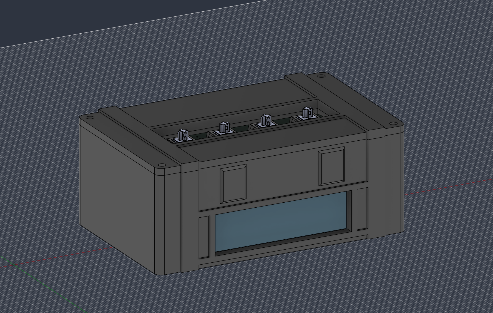
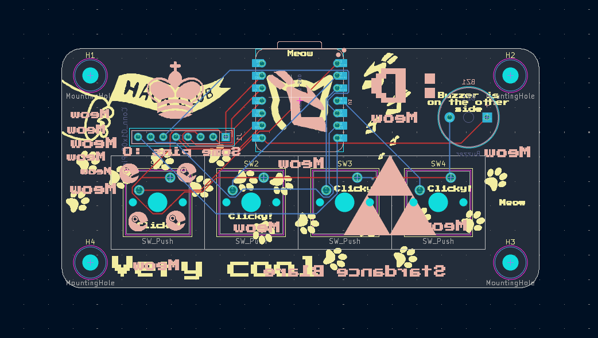

# Blare Alarm

It's an alarm that does stuff (I hope). 

## It features:
- Four keys
- One buzzer
- A screen

## Why did I choose this?
I had a lot of fun doing the Hackpad mission. I decided to do this as well, it looks pretty cool.

## Screenshots

## BOM
- 1x Seeed XIAO ESP32C3
- 4x MX-Style Keyboard Switches
- 4x White Blank DSA Keycaps
- 1x 2.25in TFT Screen
- 1x 3.3V Piezo Buzzer
- 1x 2.54mm 8 Pin Male Header (For connecting your screen)
- 8x 20cm Female-Female Jumper Wires (For connecting your screen off of the pcb)
- 8x M3x5x4 Heatset Inserts
- 4x M3x8mm Screws
- 4x M3x16mm Screws

(I haven't decided on a name yet)